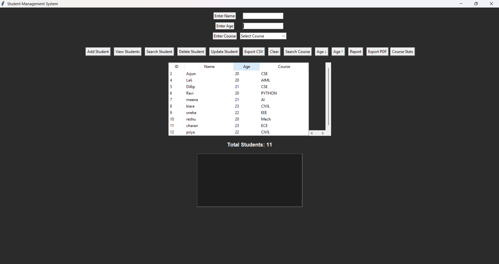

# Student Management System

A desktop-based Student Management System developed using Python, Tkinter, SQLite, and ReportLab.

## Features

- Add Student
- View Students
- Search Student
- Update Student
- Delete Student
- Live Search
- Course-wise Search
- Course Statistics
- Sort Students by Age
- Export Data to CSV
- Export Reports to PDF

## Technologies Used

- Python
- Tkinter
- SQLite
- ReportLab

## How to Run

1. Install Python
2. Install ReportLab

```bash
pip install reportlab
```

3. Run the project

```bash
python student_management_sqlite.py
```

## Screenshots

### Home Page



### Course Search


### Sorting by Age


## Author

Lalitha
